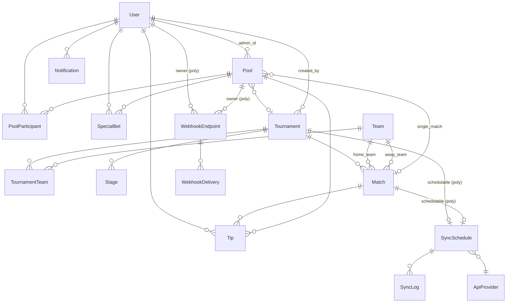

# PLAN.md — Open Bolão

## Contexto

Sistema de bolão de futebol multi-torneio, self-hosted, construído em Rails 8. Suporta dois escopos de bolão (torneio ou jogo único), três roles (super_admin / admin / user), sincronização automática com APIs externas, webhooks com HMAC, ranking em tempo real via ActionCable e deploy via Docker/CasaOS.

---

## Diagrama de Entidades



---

## Decisões técnicas

### Team como entidade global
`Team` não pertence a nenhum torneio — o relacionamento é via `TournamentTeam`. Isso evita duplicação de times (ex: Brasil) ao participar de múltiplos torneios. Times criados via API têm `created_by_id = nil`.

### Match.tournament_id nullable
Permite bolões de jogo único sem precisar criar um torneio fictício. Admin cria o jogo avulso inline ao criar o bolão.

### Pool.pool_scope enum
`tournament` ou `single_match`. A validação garante consistência: escopo torneio → `tournament_id` obrigatório; escopo jogo → `match_id` obrigatório. Multiplicadores de fase só se aplicam em torneio.

### SyncSchedule polymorphic + SchedulerJob master
O `Sync::SchedulerJob` roda a cada 1 minuto (cron leve) e apenas decide o que enfileirar. O `FetchResultsJob` é o worker pesado, executado por cada schedule. Isso mantém o cron eficiente e os workers isolados.

### Auto-pausa após 5 falhas consecutivas
`SyncSchedule.record_failure!` incrementa `consecutive_failures`. Ao atingir 5, define `paused_until = 30min`, notifica super admin. Impede spam de erros.

### Webhooks com HMAC-SHA256
Signature no header `X-Bolao-Signature: sha256=<hmac>`. Secret gerado automaticamente por endpoint. Retry com backoff exponencial (1min, 5min, 15min) via `Webhooks::RetryJob`.

### Solid adapters substituídos por Redis
Rails 8.1 usa Solid Queue/Cache/Cable por padrão. Substituídos por Redis + Sidekiq para consistência com o requisito de arquitetura e para suportar Sidekiq::Web.

---

## Fases de implementação

| Fase | Commits | O que foi implementado |
|---|---|---|
| 1 — Fundação | 1–5 | rails new, gems, 16 migrations, 13 models, Devise, Pundit |
| 2 — Core | 6–7 | TipScoringService, RankingService, controllers, views, i18n |
| 3 — Admin | 7 | Admin::Pools, Admin::Matches, SuperAdmin namespace |
| 4 — Integração | 8–10 | Worldcup2026Adapter, SchedulerJob, FetchResultsJob, seeds |
| 5 — Real-time | 9 | ActionCable (3 canais), Webhooks HMAC, Notifications |
| 6 — Qualidade | 11–13 | Rack::Attack, Docker multi-stage, RSpec, README |

---

## Verificação end-to-end

```bash
# 1. Setup local
bin/rails db:create db:migrate db:seed

# 2. Iniciar servidor
bin/dev

# 3. Login: admin@bolao.local / changeme123!

# 4. Docker
docker compose up --build

# 5. Testes
bundle exec rspec
```
